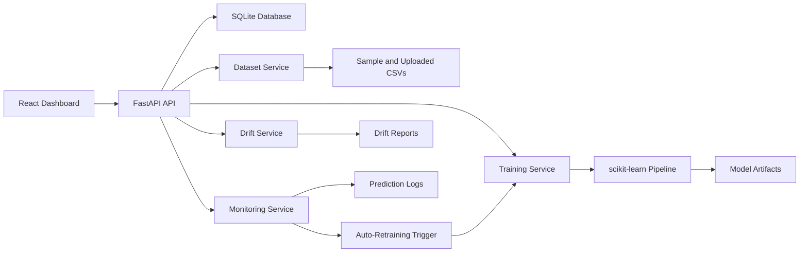

# MLOps Model Monitoring & Auto-Retraining Platform

Final-year B.Tech CSE Data Science project by **Param Saxena**  
Email: **param5saxena@gmail.com**

This is a full-stack MLOps platform that trains a scikit-learn classification model, tracks model versions, detects data drift, monitors prediction traffic, and automatically retrains when drift or performance degradation is detected.

## Tech Stack

- Backend: FastAPI, SQLAlchemy, SQLite, pandas, scikit-learn
- Frontend: React.js, Vite, TypeScript, lucide-react
- ML: RandomForestClassifier with preprocessing pipeline
- Storage: SQLite by default, PostgreSQL-ready through `DATABASE_URL`
- Workflow: upload/select datasets, train, evaluate, drift-check, monitor, retrain

## Key Features

- CSV dataset upload and sample dataset selection
- Model training using scikit-learn
- Accuracy, precision, recall, F1 score, confusion matrix, and feature importance
- Model version registry with active/archived versions
- Data drift detection using PSI for numeric features and distribution distance for categorical features
- Prediction logging with latency, confidence, and model version
- Monitoring dashboard with drift, model quality, traffic, and retraining events
- Auto-retraining when drift or F1 degradation crosses thresholds
- Clean API endpoints documented through FastAPI Swagger
- VS Code tasks for running backend and frontend

## Project Structure

```text
.
├── backend/
│   ├── app/
│   │   ├── main.py
│   │   ├── models.py
│   │   ├── schemas.py
│   │   └── services/
│   ├── artifacts/models/
│   ├── data/uploads/
│   ├── tests/
│   └── requirements.txt
├── frontend/
│   ├── src/
│   ├── package.json
│   └── vite.config.ts
├── sample_data/
├── docs/
├── screenshots/
├── scripts/
└── .vscode/
```

## Local Setup

Open this project folder in VS Code:

```powershell
cd "C:\Users\ASUS\OneDrive\Desktop\MLOps Model Monitoring & Auto-Retraining Platform"
code .
```

### Backend

```powershell
cd backend
py -3.13 -m venv .venv
.\.venv\Scripts\activate
python -m pip install --upgrade pip
python -m pip install -r requirements.txt
python ..\scripts\generate_sample_data.py
python -m uvicorn app.main:app --reload --host 127.0.0.1 --port 8000
```

Backend URLs:

- API: `http://127.0.0.1:8000`
- Swagger docs: `http://127.0.0.1:8000/docs`
- Health check: `http://127.0.0.1:8000/api/health`

### Frontend

Open a second terminal:

```powershell
cd frontend
npm install
npm run dev
```

Frontend URL:

- Dashboard: `http://127.0.0.1:5173`

### VS Code Tasks

Use **Terminal > Run Task**:

- `Backend: FastAPI`
- `Frontend: Vite`

## Demo Flow

1. Start backend and frontend.
2. Open the dashboard.
3. Train a model on `Customer Churn Baseline`.
4. Compare baseline against `Customer Churn Drifted`.
5. Run the monitor cycle.
6. Review the new model version if auto-retraining is triggered.
7. Generate demo predictions and inspect the prediction monitoring log.

## API Highlights

- `GET /api/datasets`
- `POST /api/datasets/upload`
- `POST /api/train`
- `GET /api/models`
- `GET /api/models/active`
- `POST /api/drift`
- `POST /api/predict`
- `POST /api/monitor/run`
- `GET /api/monitoring/summary`
- `POST /api/monitoring/demo-predictions`

More examples are in [docs/API_EXAMPLES.md](docs/API_EXAMPLES.md).

## Architecture



Detailed architecture notes are in [docs/ARCHITECTURE.md](docs/ARCHITECTURE.md).
