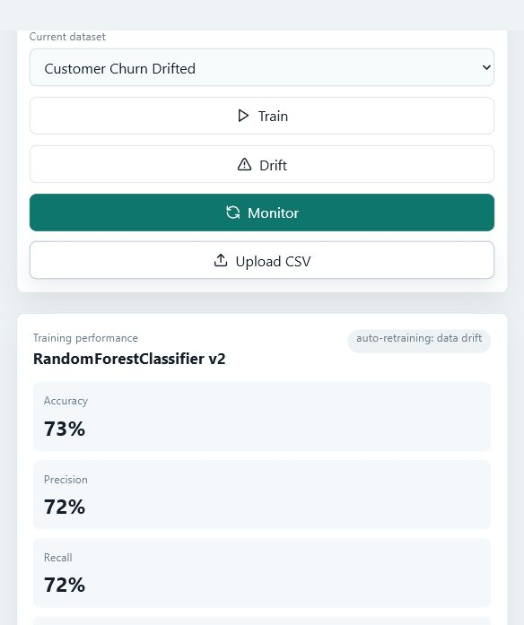
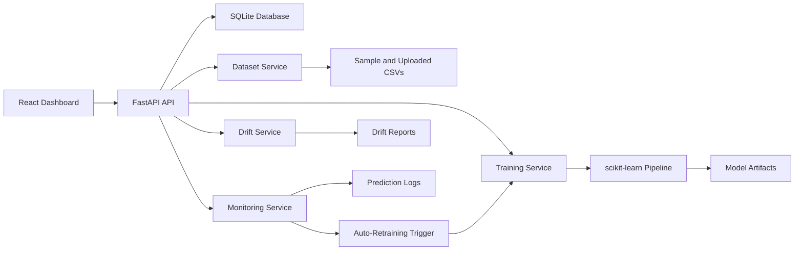

# MLOps Model Monitoring & Auto-Retraining Platform

Final-year B.Tech CSE Data Science project by **Param Saxena**  
Email: **param5saxena@gmail.com**

A full-stack MLOps platform for training, monitoring, drift detection, prediction observability, model versioning, and automatic retraining. This is designed as a portfolio-ready final-year project, not a basic CRUD app.



## Highlights

- FastAPI backend with clear REST endpoints and Swagger docs
- React + Vite + TypeScript dashboard UI
- SQLite storage with PostgreSQL-ready `DATABASE_URL` support
- Sample customer churn datasets included
- CSV dataset upload and dataset preview workflow
- scikit-learn model training with preprocessing pipeline
- Accuracy, precision, recall, F1 score, confusion matrix, and feature importance
- Model version registry with active and archived model versions
- Data drift detection between baseline and current datasets
- Prediction monitoring with class distribution, latency, and request logs
- Auto-retraining when drift or performance degradation crosses thresholds
- VS Code tasks, setup scripts, architecture docs, and API examples

## Tech Stack

| Layer | Tools |
| --- | --- |
| Backend | FastAPI, SQLAlchemy, Uvicorn |
| Frontend | React.js, Vite, TypeScript |
| Machine Learning | pandas, scikit-learn, joblib |
| Database | SQLite by default, PostgreSQL-compatible config |
| Monitoring | Drift reports, prediction logs, retraining events |

## Project Structure

```text
.
|-- backend/
|   |-- app/
|   |   |-- main.py
|   |   |-- models.py
|   |   |-- schemas.py
|   |   `-- services/
|   |-- artifacts/models/
|   |-- data/uploads/
|   |-- tests/
|   `-- requirements.txt
|-- frontend/
|   |-- src/
|   |-- package.json
|   `-- vite.config.ts
|-- sample_data/
|-- docs/
|-- screenshots/
|-- scripts/
`-- .vscode/
```

## Quick Start

Clone the repository and open it in VS Code.

```powershell
git clone https://github.com/neel-5/MLOps-Model-Monitoring-and-Auto-Retraining-Platform.git
cd MLOps-Model-Monitoring-and-Auto-Retraining-Platform
code .
```

### 1. Run Backend

```powershell
cd backend
py -3.13 -m venv .venv
.\.venv\Scripts\activate
python -m pip install --upgrade pip
python -m pip install -r requirements.txt
python ..\scripts\generate_sample_data.py
python -m uvicorn app.main:app --reload --host 127.0.0.1 --port 8000
```

Backend URLs:

- API root: `http://127.0.0.1:8000`
- Swagger docs: `http://127.0.0.1:8000/docs`
- Health check: `http://127.0.0.1:8000/api/health`

### 2. Run Frontend

Open a second terminal:

```powershell
cd frontend
npm install
npm run dev
```

Dashboard URL:

```text
http://127.0.0.1:5173
```

## VS Code Tasks

Use **Terminal > Run Task**:

- `Backend: FastAPI`
- `Frontend: Vite`

## Demo Workflow

1. Start the backend and frontend.
2. Open the dashboard at `http://127.0.0.1:5173`.
3. Train a baseline model on `Customer Churn Baseline`.
4. Compare it against `Customer Churn Drifted`.
5. Run drift detection.
6. Run the monitoring cycle.
7. Review the auto-created model version if retraining is triggered.
8. Generate demo predictions and inspect prediction monitoring logs.

## API Endpoints

| Method | Endpoint | Purpose |
| --- | --- | --- |
| GET | `/api/health` | Health check |
| GET | `/api/datasets` | List registered datasets |
| POST | `/api/datasets/upload` | Upload a CSV dataset |
| GET | `/api/datasets/{dataset_id}/preview` | Preview dataset rows |
| POST | `/api/train` | Train a model version |
| GET | `/api/models` | List model versions |
| GET | `/api/models/active` | Fetch active model |
| POST | `/api/drift` | Compare baseline and current datasets |
| POST | `/api/predict` | Make and log a prediction |
| POST | `/api/monitor/run` | Run drift/performance monitoring and auto-retraining |
| GET | `/api/monitoring/summary` | Dashboard monitoring summary |
| POST | `/api/monitoring/demo-predictions` | Generate sample prediction traffic |

More request examples are in [docs/API_EXAMPLES.md](docs/API_EXAMPLES.md).

## Architecture



Detailed architecture notes are in [docs/ARCHITECTURE.md](docs/ARCHITECTURE.md).

## Sample Datasets

The repository includes three churn datasets:

- `customer_churn_baseline.csv`
- `customer_churn_current.csv`
- `customer_churn_drifted.csv`

Regenerate them with:

```powershell
py -3.13 scripts\generate_sample_data.py
```

## Validation

These checks were run locally:

```powershell
cd backend
.\.venv\Scripts\python.exe -m pytest -q
```

```powershell
cd frontend
npm run build
```

## Author

**Param Saxena**  
Email: **param5saxena@gmail.com**

Built around Python, FastAPI, React.js, SQL, scikit-learn, backend development, workflow automation, and data science.
