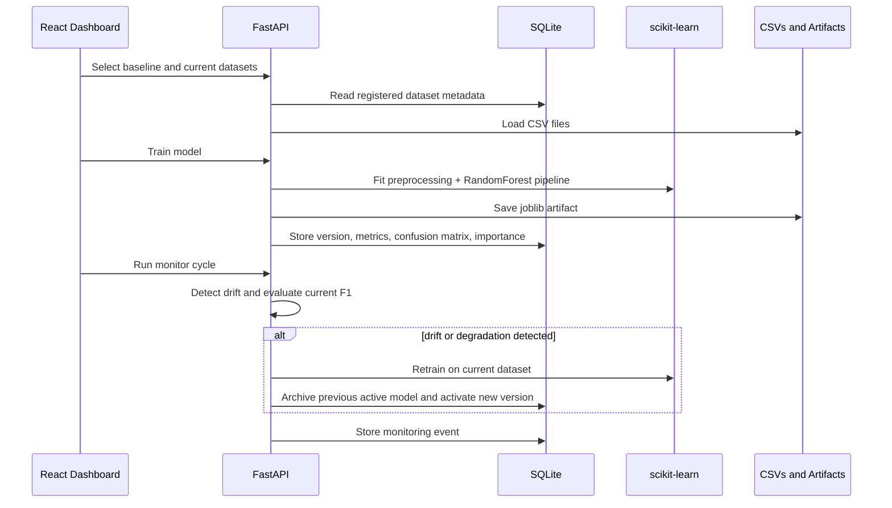

# Architecture

## System Overview

The platform is split into a FastAPI backend and a React/Vite frontend. The backend owns datasets, model training, drift detection, prediction logging, and monitoring automation. The frontend acts as an operations dashboard for running the workflow and presenting model health.



## Backend Layers

- `app/main.py`: API router and application startup.
- `app/models.py`: SQLAlchemy tables for datasets, model versions, drift reports, prediction logs, and monitoring events.
- `app/services/dataset_service.py`: CSV upload, inspection, and sample dataset registration.
- `app/services/ml_service.py`: training, evaluation, feature importance, model loading, and prediction logging.
- `app/services/drift_service.py`: feature-level drift scoring.
- `app/services/monitoring_service.py`: end-to-end monitoring cycle and auto-retraining decision.

## Database Tables

| Table | Purpose |
| --- | --- |
| `datasets` | CSV metadata, target column, feature columns, row counts |
| `model_versions` | Version registry, metrics, artifact path, active flag |
| `drift_reports` | Baseline/current comparison and feature drift results |
| `prediction_logs` | Prediction payload, class, confidence, latency, model version |
| `monitoring_events` | Drift plus performance checks and auto-retraining actions |

## ML Pipeline

The training service builds a scikit-learn `Pipeline`:

1. Numeric columns use median imputation.
2. Categorical columns use most-frequent imputation and one-hot encoding.
3. `RandomForestClassifier` trains the churn classifier.
4. The model stores accuracy, precision, recall, F1, confusion matrix, and feature importance.
5. The pipeline is saved as a versioned `.joblib` artifact.

## Drift Detection

Numeric features use Population Stability Index. Categorical features use total variation distance between category distributions. A drift report stores each feature score, drift status, overall max drift score, and retraining recommendation.

Default threshold:

```text
feature_score >= 0.20
```

## Auto-Retraining Logic

The monitor cycle compares:

- Baseline model F1 against current dataset F1
- Baseline dataset distribution against current dataset distribution

Retraining is triggered when:

```text
drift_detected == true OR baseline_f1 - current_f1 >= degradation_threshold
```

When triggered, the current active model is archived, a new version is trained on the current dataset, and a monitoring event records the action.
